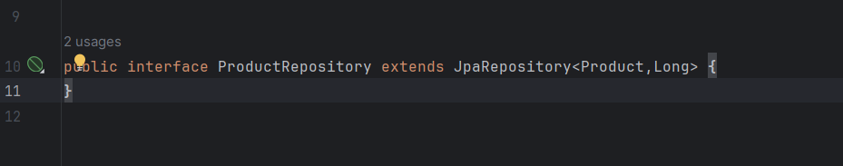

<h1>Compte rendu TP2</h1>

<h3>Application de gestion de produits</h3>

<h3>Architecture du projet :</h3>

<h3>les dépendances JPA, H2, Spring Web et Lombock :</h3>

<h3>l'entité JPA Product</h3>

<h3> Configurer l'unité de persistance dans le ficher application.properties :</h3>

<h3>l'interface JPA Repository basée sur Spring data:</h3>

<h3>Ajout des Produits :</h3>

<h3>Consulter tous les produit : </h3>

<h3>Consulter un produit</h3>

<h3>Chercher un produit</h3>

<h3>Modifier un produit:</h3>

<h3>Supprimer un produit:</h3>

<h3>Afficher sur le web:>
